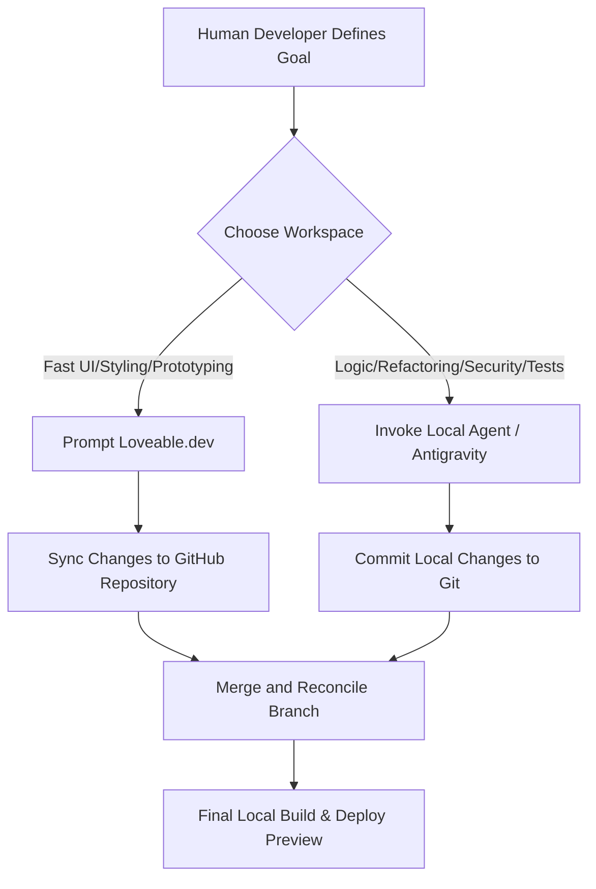

# Cooperation Workflows: Loveable & Local Agents

This document defines how human developers, Loveable (cloud platform), and local AI agents (Antigravity, Cursor, etc.) work together efficiently without causing merge conflicts or breaking the application.

---

## The Landscape of Contributors

1. **Loveable.dev**: Excellent for fast, prompt-driven UI iterations, initial layouts, styling feedback, and instant web previews.
2. **Local AI Agents (e.g. Antigravity)**: Excellent for architectural refactoring, complex backend logic (Nitro server endpoints, file system processing), deep debugging, and security auditing (e.g., sanitizers).
3. **Human Developer**: The orchestrator who sets requirements, reviews code quality, tests the app, and merges code.

---

## Collaborative Workflow Model

### Protocol 1: Avoiding Conflicts in the Plan

- **Rule**: Loveable keeps its internal state in `.lovable/plan.md`. Local agents must never modify this file unless explicitly instructed.
- **Rule**: If a local agent implements a major change, it should log the decision in `.agents/decision_log.md`. The human developer can then inform Loveable of this structural change using a prompt in the Loveable UI to synchronize its understanding.

### Protocol 2: Coding Standards & Git Flow

- **Branches**: Run feature branches when using local agents, or verify files before pulling changes from the Loveable branch.
- **Pre-commit Checks**: Run linting and formatting locally (`bun run format` and `bun run lint`) before committing, ensuring code matches Prettier rules so Loveable parses it without errors.
- **Keep Files Modular**: Break larger files into sub-components under `src/components/designer/` rather than creating one giant component. Loveable and local agents can edit smaller files simultaneously with minimal merge conflicts.
